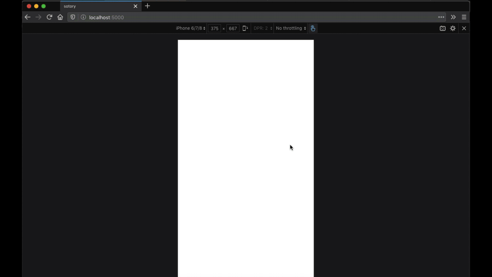

# sotory

create Instagram-like story on the web.

This is still under heavy development and for our blog posts purpose.

## Demo



## Development

- Clone repo
- Install `devDependencies` in case you don't have `serve` installed globally
- `yarn dev`

## Usage

To use this library you need to setup your configuration file.

Folder structure:

```
    .
    ├── ...
    ├── lib                    
    │   ├── config.js      # create config.js file
    │   ├── sotory.js         
    │   └── sotory.css           
    └── ...
```


| Key         | Value  | Description                                                  |
| ----------- | ------ | :----------------------------------------------------------- |
| storyLength | number | **Required**. Length of each story (in millisecond)          |
| endpoint    | string | **Required**. Source of your data<br />You can use [jsonbox.io](https://jsonbox.io), like we did |
| avatar      | string | **Required**. Avatar just like your Instagram                |
| identifier  | string | Not used yet. xD                                             |
| target      | string | **Required**. Target DOM element. To display the avatar. (Must be an `id`) |


This is an example data for `jsonbox.io` :

```json
[
    {
        "type": "image",
        "url": "https://i.pinimg.com/originals/69/59/fa/6959fa736605235642d0f057e6cf9795.jpg",
    },
    {
        "type": "image",
        "url": "https://i.pinimg.com/originals/69/59/fa/6959fa736605235642d0f057e6cf9795.jpg",
    }
]
```


Configuration file example:

```js
;(function() {
  const FIVE_SECOND = 5000
  const target = document.createElement('div')
  const config = {
    storyLength: FIVE_SECOND,
    endpoint: 'https://jsonbox.io/box_14a7d13709787b6b8bfe',
    avatar: 'https://avatars0.githubusercontent.com/u/43804217?v=4',
    identifier: 'evilfactorylabs',
    target: '#js-sotory'
  }

  target.setAttribute('id', 'js-sotory')
  document.body.appendChild(target)

  const sotory = new Sotory(config)

  sotory.init()
})()
```


Then import configuration file to `index.html`.

```html
<body>
    <script src="../lib/sotory.js"></script>
    <script src="../lib/config.js"></script>
</body>
```


Enjoy.

## LICENSE

```
The MIT License (MIT)
Copyright (c) 2019 evilfactorylabs

Permission is hereby granted, free of charge, to any person obtaining a copy
of this software and associated documentation files (the "Software"), to deal
in the Software without restriction, including without limitation the rights
to use, copy, modify, merge, publish, distribute, sublicense, and/or sell
copies of the Software, and to permit persons to whom the Software is
furnished to do so, subject to the following conditions:

The above copyright notice and this permission notice shall be included in all
copies or substantial portions of the Software.

THE SOFTWARE IS PROVIDED "AS IS", WITHOUT WARRANTY OF ANY KIND,
EXPRESS OR IMPLIED, INCLUDING BUT NOT LIMITED TO THE WARRANTIES OF
MERCHANTABILITY, FITNESS FOR A PARTICULAR PURPOSE AND NONINFRINGEMENT.
IN NO EVENT SHALL THE AUTHORS OR COPYRIGHT HOLDERS BE LIABLE FOR ANY CLAIM,
DAMAGES OR OTHER LIABILITY, WHETHER IN AN ACTION OF CONTRACT, TORT OR
OTHERWISE, ARISING FROM, OUT OF OR IN CONNECTION WITH THE SOFTWARE OR THE USE
OR OTHER DEALINGS IN THE SOFTWARE.
```
